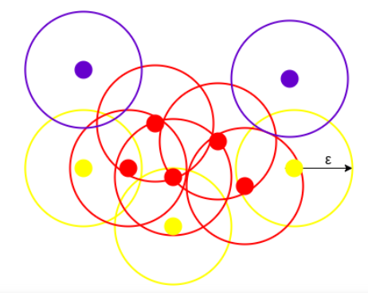

# Architectural clusterizator

## Requirments
- python
- numpy
- pandas
- st_dbscan
- matplotlib

## Undersanding DBSCAN
DBSCAN creates a circle of epsilon radius around every data point and classifies them into Core point, Border point, and Noise. A data point is a Core point if the circle around it contains at least ‘minPoints’ number of points. If the number of points is less than minPoints, then it is classified as Border Point, and if there are no other data points around any data point within epsilon radius, then it treated as Noise.

  

The above figure shows us a cluster created by DBCAN with minPoints = 3. Here, we draw a circle of equal radius epsilon around every data point. These two parameters help in creating spatial clusters.
All the data points with at least 3 points in the circle including itself are considered as Core points represented by red color. All the data points with less than 3 but greater than 1 point in the circle including itself are considered as Border points. They are represented by yellow color. Finally, data points with no point other than itself present inside the circle are considered as Noise represented by the purple color.

For locating data points in space, DBSCAN uses Euclidean distance

## TODO
 